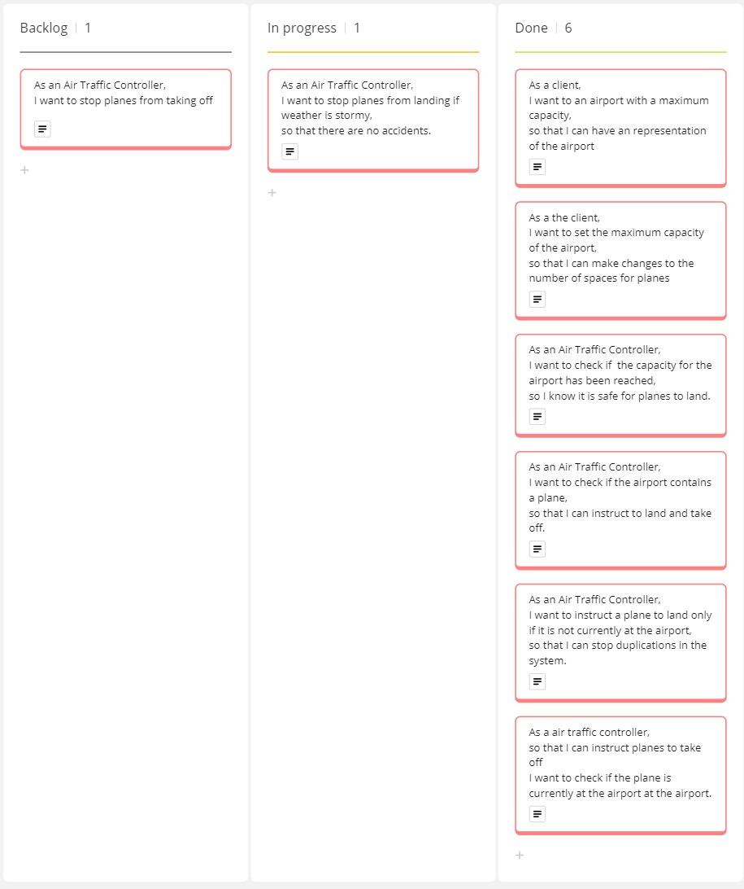

# Domain Models and Test Plan

## Core Requirements

## User Story 1

### Domain model for User Story 1
|Object |Properties|Messages|Output|
|------ |----------|--------|------|
|Airport|- Capacity @Integer  |        |- @Void|

### Test Plan for User Story 1
- **Test 1.1**: Create an airport and check that the capacity is 10.

## User Story 2

### Domain model for User Story 2
| Object  | Properties          | Messages | Output  |
| ------- | ------------------- | -------- | ------- |
| Airport | - Capacity @Integer |- setCapacity(@Integer)          | - @Void |

### Test Plan for User Story 2
- **Test 2.1**: Test the capacity can be changed by using setCapacity.
- **Test 2.2**: Test that the existing capacity change be changed multiple times.
- **Test 2.3**: Test the capacity cannot be set to a negative number.
- **Test 2.4**: Test the capacity cannot be set to a null value.
- 
## User Story 3

### Domain Model for User Story 3
| Object  | Properties          | Messages | Output  |
| ------- | ------------------- | -------- | ------- |
| Airport | - Capacity @Integer |- isAirportFull()     | - @Boolean |
|         | - Planes @Array(@Plane)||         |
|Plane| |||

### Test Plan for User Story 3
- **Test 3.1**: Test an empty airport to check if there is space to land.
- **Test 3.2**: Test an airport at max capacity to see airport is full.

## User Story 4

### Domain Model for User Story 4
| Object  | Properties          | Messages | Output  |
| ------- | ------------------- | -------- | ------- |
| Airport | - Planes @Array(@Plane)|- doesAirportContain(@Plane)          | - @Boolean |
|Plane|- planeID @String |||

### Test Plan for User Story 4
- **Test 4.1**: Search for a plane that is not at the airport, should return false.
- **Test 4.2**: Add a plane to an empty airport and check if it is stored properly should return true.
- **Test 4.3**: Add multiple planes to the airport and check if doesAirportContain() can find a plane stored at the airport

## User Story 5

### Domain Model for User Story 5
| Object  | Properties          | Messages | Output  |
| ------- | ------------------- | -------- | ------- |
| Airport | - Planes @Array(@Plane) |- landPlane(@Plane)          | - @Void |
|   |- doesAirportContain() |||
|Plane|- planeID @String |||

### Test Plan for User Story 5
- **Test 5.1**: Land a plane at empty airport and check plane array increases by 1.
- **Test 5.2**: Land a plane and check that the same plane is stored in the array.
- **Test 5.3**: Try land a plane at airport that has reached capacity, should not add to planes array.
- **Test 5.4**: Try land a plane already at the airport should not increase array and return error message.

## User Story 6

### Domain Model for User Story 6
| Object  | Properties          | Messages | Output  |
| ------- | ------------------- | -------- | ------- |
| Airport | - Capacity @Integer |- takeOff(@Plane)          | - @Void |
|   |- doesAirportContain()   |||
|Plane| |||

### Test Plan for User Story 6
- **Test 6.1**: Test that when a plane at the airport takes off the array length decreases.
- **Test 6.2**: Test that when a plane at the airport takes off the array is updated and plane is no longer at the airport.
- **Test 6.3**: Test that when trying to take off a plane that is not at the airport, no planes take off and a error message shown.
  
## Additional Features

## User Story 7

### Domain Model for User Story 7
| Object  | Properties          | Messages | Output  |
| ------- | ------------------- | -------- | ------- |
| Airport | - stormyWeather @Boolean |- isWeatherStormy         | - @Boolean |
||- Planes @Array(@Planes) |- landPlane(@Plane)|- @Void|
|Plane|- planeID @String |||

### Test Plan for User Story 7
- **Test 7.1**: Land a plane then set weather as stormy, try land new plane and check planes size does not increase.
- **Test 7.2**: Set weather as stormy, try land plane and check plane is not stored in the array planes.

## User Story 8

### Domain Model for User Story 8
| Object  | Properties          | Messages | Output  |
| ------- | ------------------- | -------- | ------- |
| Airport | - stormyWeather @Boolean |- isWeatherStormy         | - @Void |
|         |- Planes @Array(@Planes) |- takeOff(@Plane)|- @Void|
|Plane|- planeID @String |||

### Test Plan for User Story 8
- **Test 8.1**: Set weather to stormy and try to take off with a plane at the airport then check plane array did not decrease.
- **Test 8.2**: Set weather to stormy and try to take off with a plane at the airport then check plane is still at the airport.

## Kanban Board for this project

